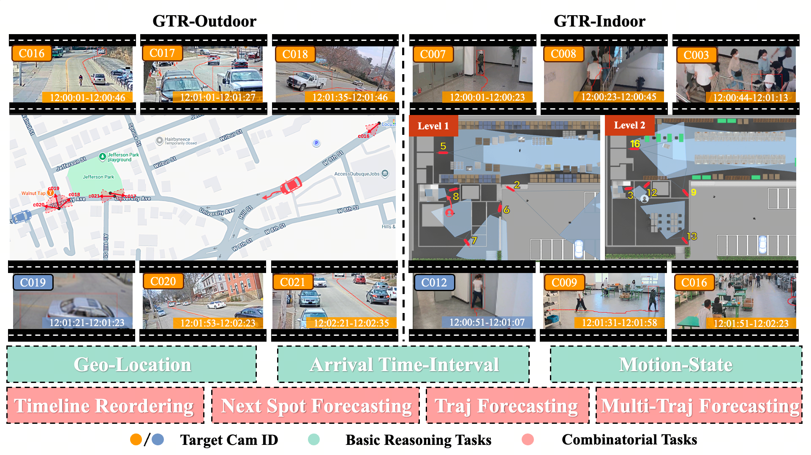
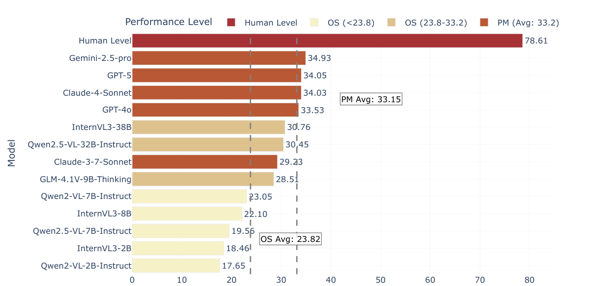
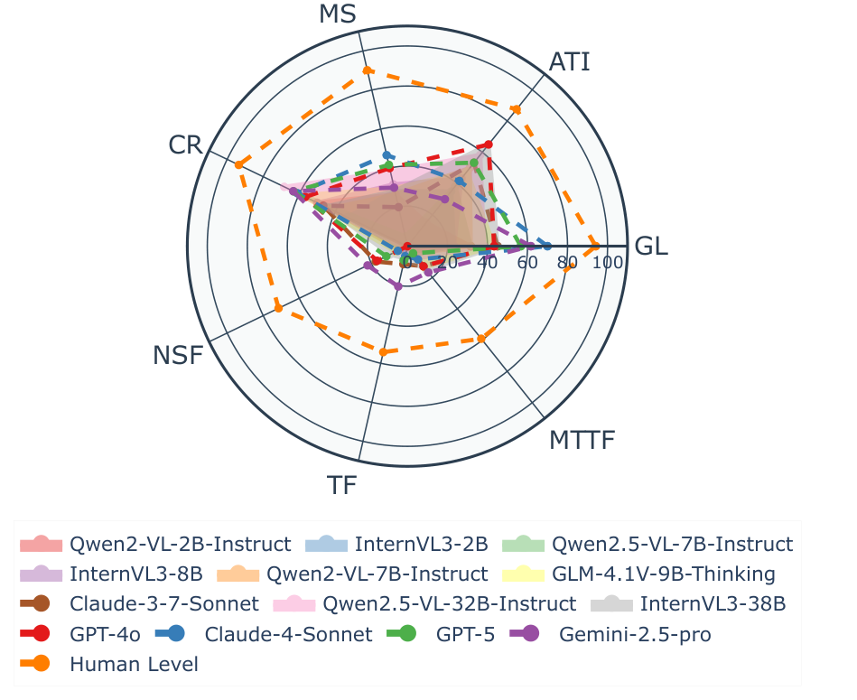

# GTR-Bench: Evaluating Geo-Temporal Reasoning in Vision-Language Models

[](LICENSE)

## 📅 Project Log

This section tracks the development and release timeline of GTR-Bench.

| Date | Milestone |
|------|-----------|
| **Apr 2025** | Project launched. Initial benchmark design and task formulation for geo-temporal reasoning in multi-camera networks. |
| **May–Sep 2025** | Data collection and annotation. Benchmark construction using CityFlow (outdoor) and MTMMC (indoor) datasets. Design of 7 task types spanning basic reasoning (GL, ATI, MS) and combinatorial tasks (CR, NSF, TF, MTTF). |
| **Oct 2025** | Benchmark completion. Evaluation of 10+ VLMs; analysis of performance gaps and model deficiencies. |
| **Nov 2025** | Paper published on [arXiv](https://arxiv.org/) and code/data open-sourced on GitHub. |
| **Jan 2026** | **Accepted by ICLR 2026** 🎉 |

---

## 📖 Abstract

Recently spatial-temporal intelligence of Visual-Language Models (VLMs) has attracted much attention due to its importance for Autonomous Driving, Embodied AI and General Artificial Intelligence. Existing spatial-temporal benchmarks mainly focus on egocentric perspective reasoning with images/video context, or geographic perspective reasoning with graphics context (eg. a map), thus fail to assess VLMs' geographic spatial-temporal intelligence with both images/video and graphics context, which is important for areas like traffic management and emergency response. To address the gaps, we introduce Geo-Temporal Reasoning benchmark (GTR-Bench), a novel challenge for geographic temporal reasoning of moving targets in a large-scale camera network. GTR-Bench is more challenging as it requires multiple perspective switches between maps and videos, joint reasoning across multiple videos with non-overlapping fields of view, and inference over spatial-temporal regions that are unobserved by any video context. Evaluations of more than 10 popular VLMs on GTR-Bench demonstrate that even the best proprietary model, Gemini-2.5-Pro (34.9\%), significantly lags behind human performance (78.61\%) on geo-temporal reasoning. Moreover, our comprehensive analysis on GTR-Bench reveals three primary deficiencies of current models for geo-temporal reasoning. (1) VLMs' reasoning is impaired by an imbalanced utilization of spatial-temporal context. (2) VLMs are weak in temporal forecasting, which leads to worse performance on temporal-emphasized tasks than on spatial-emphasized tasks. (3) VLMs lack the proficiency to comprehend or align the map data with multi-view video inputs. We believe GTR-Bench offers valuable insights and opens up new opportunities for research and applications in spatial-temporal intelligence.

📄 **Paper**: [arXiv:2510.07791](https://arxiv.org/pdf/2510.07791)

---

## ✨ GTR-Bench Overview



***Overview of Geo-temporal Reasoning and GTR-Bench.** Given a graphic map and multiple video clips from non-overlapping cameras, geo-temporal reasoning infers motion state of moving targets in a large-scale camera network. GTR-Bench comprises 3 basic reasoning tasks, including Geo-location, Arrival Time-Interval, and Motion-State, and 4 combinatorial tasks including Causal Reordering, Next Spot Forecasting, Trajectory Forecasting, and Multi-Target Trajectory Forecasting. GTR-Bench covers both outdoor (vehicles) and indoor (pedestrians) scenarios.*

### 🧠 Task Types

#### 📋 Basic Tasks
- **Geo-Location (GL)**: Infer intermediate locations between start/end points
- **Arrival Time-Interval (ATI)**: Predict time interval of target's arrival at specific location  
- **Motion-State (MS)**: Infer target's motion state at intermediate locations

#### 🔗 Combinatorial Tasks
- **Causal Reordering (CR)**: Determine correct chronological sequence from unordered video clips
- **Next Spot Forecasting (NSF)**: Predict next camera location and time interval
- **Trajectory Forecasting (TF)**: Forecast complete future trajectory sequence
- **Multi-Target Trajectory Forecasting (MTTF)**: Predict meeting point of two targets

---

## 📊 Results

| | |
|:---:|:---:|
|  |  |
| *Overview of GTR-Bench Results. Average performance across VLMs. OS = Open-source; PM = Proprietary.* | *Task performance of GTR-Bench.* |

### Detailed Results

| **Methods** | **Rank** | GL | ATI | MS | CR | NSF | TF | MTTF | GL | ATI | MS | CR | NSF | TF | MTTF | **Avg** |
|-------------|----------|-----|-----|-----|-----|-----|-----|------|-----|-----|-----|-----|-----|-----|------|--------|
| *Proprietary Models (API)* | | | | | | | | | | | | | | | | |
| Claude-3-7-Sonnet | 7 | 53.33 | 66.67 | 26.67 | 46.67 | **25.75** | 8.90 | 21.97 | 36.67 | 40.00 | 13.33 | 46.67 | 9.48 | 9.51 | 3.56 | 29.23 |
| GPT-4o | 4 | 56.67 | **76.67** | 40.00 | 63.33 | 20.53 | 0.00 | **23.10** | 30.00 | 53.33 | 40.00 | 50.00 | 13.00 | 0.00 | 2.79 | 33.53 |
| Claude-4-Sonnet | 3 | **73.33** | 50.00 | **50.00** | 63.33 | 8.05 | 6.18 | 16.94 | **66.67** | 33.33 | 43.33 | 58.62 | 2.60 | 4.01 | 0.00 | 34.03 |
| GPT-5 | 2 | 53.33 | **76.67** | 40.00 | 40.00 | 12.04 | 12.12 | 7.34 | 60.00 | 30.00 | **43.33** | **86.21** | 11.34 | 2.55 | 1.75 | 34.05 |
| Gemini-2.5-Pro | 1 | 60.00 | 46.67 | 33.33 | 56.67 | 19.13 | **13.16** | 19.18 | 63.33 | 13.33 | 26.67 | 70.00 | **25.11** | **28.09** | **14.37** | **34.93** |
| *Open-source Models* | | | | | | | | | | | | | | | | |
| Qwen2-VL-2B-Instruct | 13 | 33.33 | 16.67 | 20.00 | 56.67 | 0.00 | 0.28 | 0.00 | 30.00 | 13.33 | 33.33 | 43.33 | 0.00 | 0.21 | 0.00 | 17.65 |
| InternVL3-2B | 12 | 33.33 | 46.67 | 23.33 | 36.67 | 6.15 | 0.00 | 9.95 | 13.33 | 23.33 | 33.33 | 30.00 | 0.65 | 0.08 | 1.62 | 18.46 |
| Qwen2.5-VL-7B-Instruct | 11 | 23.33 | 46.67 | 3.33 | 60.00 | 0.00 | 0.00 | 0.51 | 40.00 | 30.00 | 6.67 | 63.33 | 0.00 | 0.00 | 0.00 | 19.56 |
| InternVL3-8B | 10 | 26.67 | 60.00 | 33.33 | 50.00 | 0.00 | 4.79 | 5.42 | 20.00 | 26.67 | 30.00 | 50.00 | 0.00 | 0.79 | 1.67 | 22.10 |
| Qwen2-VL-7B-Instruct | 9 | 43.33 | 60.00 | 16.67 | 50.00 | 5.78 | 0.00 | 10.01 | 20.00 | 40.00 | 36.67 | 36.67 | 3.62 | 0.00 | 0.00 | 23.05 |
| GLM-4.1V-9B-Thinking | 8 | 60.00 | 57.14 | 25.00 | 62.07 | 10.29 | 0.00 | 25.38 | 26.67 | 38.46 | 34.48 | 55.17 | 2.87 | 0.00 | 1.67 | 28.51 |
| Qwen2.5-VL-32B-Instruct | 6 | 43.33 | 60.00 | 33.33 | **66.67** | 0.65 | 0.00 | 15.72 | 33.33 | **56.67** | **43.33** | 70.00 | 3.33 | 0.00 | 0.00 | 30.45 |
| InternVL3-38B | 5 | 40.00 | 73.33 | 30.00 | 53.33 | 8.27 | 8.20 | 20.58 | 50.00 | **56.67** | 26.67 | 37.93 | 11.10 | 4.37 | 10.24 | 30.76 |
| **Human Level** | - | 90.00 | 84.25 | 90.91 | 89.75 | 68.31 | 51.24 | 55.83 | 98.20 | 90.78 | 89.45 | 97.35 | 74.64 | 57.36 | 62.46 | **78.61** |

*Our evaluation based on more than 10 popular VLMs reveals a critical performance gap. **Bold** = best result; *Underline* = second best result.*

---

## 📦 GTR-Benchmark Construction

### Source Data Download

> ⚠️ **Important**: Before using GTR-Bench, you need to download and prepare the required datasets.

#### 🌆 Outdoor Scenarios (CityFlow Dataset)

- **Source**: [AI City Challenge](https://www.aicitychallenge.org/)
- **Purpose**: Vehicle tracking and re-identification

**Expected directory structure:**
```
./data/outdoor/cityflow/
└── AICity22_Track1_MTMC_Tracking/
    └── train/
        └── S04/
            └── c020/
                └── vdo.avi
```

#### 🏠 Indoor Scenarios (MTMMC Dataset)

- **Source**: [MTMMC Dataset](https://sites.google.com/view/mtmmc)
- **Purpose**: Multi-modal camera tracking

**Expected directory structure:**
```
./data/indoor/mtmmc/
└── train/
    └── s01/
        └── c03/
            └── rgb/
```

### Data Structure

GTR-Bench organizes data by scenario type:

```
data/
├── indoor/                    # Indoor scenario (pedestrians)
│   ├── mtmmc/                 # MTMMC dataset
│   └── homography/            # Indoor camera homography data
└── outdoor/                   # Outdoor scenario (vehicles)
    └── cityflow/              # CityFlow dataset
```

### Usage

1. **Download** the source datasets from the official links above
2. **Place** the data in the corresponding directories following the expected structure
3. **Reference** the map images and video clips for geo-temporal reasoning tasks
4. The benchmark supports both **outdoor** (vehicle) and **indoor** (pedestrian) scenarios across 7 task types

---

## 🙏 Acknowledgments

- **CityFlow Dataset**: AI City Challenge organizers
- **MTMMC Dataset**: Multi-Target Multi-Modal Camera tracking team
